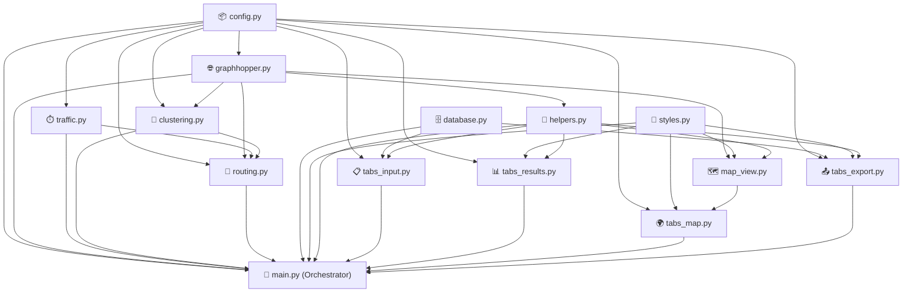

# 🍱 Sistem CFRS Katering — InzanRoute Pro

[](https://python.org)
[](https://streamlit.io)
[](https://graphhopper.com)
[](https://sqlite.org)
[](#)

Aplikasi berbasis web **Streamlit** untuk perencanaan rute distribusi *catering box* secara otomatis dan presisi di area Bantul dan Sleman, Yogyakarta. 

Sistem ini mengimplementasikan pendekatan **Cluster First, Route Second (CFRS)** dengan mengintegrasikan **K-Medoids** termodifikasi (Tabu Set R kapasitas), **Hybrid Genetic Algorithm + Tabu Search (GA-TS)**, serta **GraphHopper Localhost** untuk perhitungan jarak nyata di jalan raya, yang disesuaikan secara dinamis dengan **Koefisien Kemacetan Waktu (Time-Varying $\gamma_p$)**.

---

## 📌 Daftar Isi
1. [📸 Visualisasi Dashboard (Demo UI)](#-visualisasi-dashboard-demo-ui)
2. [📁 Peta Navigasi Kode (Struktur Proyek)](#-peta-navigasi-kode-struktur-proyek)
3. [🚀 Panduan Setup & Cara Menjalankan](#-panduan-setup--cara-menjalankan)
4. [☁️ Panduan Upload GitHub (PENTING)](#%EF%B8%8F-panduan-upload-github-penting)
5. [⚙️ Arsitektur & Alur Data](#%EF%B8%8F-arsitektur--alur-data)
6. [🧬 Pipeline & Konfigurasi Algoritma](#-pipeline--konfigurasi-algoritma)
7. [📊 Batasan & Constraints Sistem](#-batasan--constraints-sistem)

---

## 📸 Visualisasi Dashboard (Demo UI)

Klik bagian di bawah ini untuk menampilkan screenshot antarmuka sistem yang dikembangkan:

<details>
<summary><b>📖 1. Tab 1: Input Pesanan (Data Editor & Parser)</b></summary>
<p align="center">
  
  <br/>
  <i>Antarmuka input pesanan interaktif dilengkapi KPI bar, manual form, WhatsApp text parser, dan CSV uploader.</i>
</p>
</details>

<details>
<summary><b>🧬 2. Eksekusi Optimasi & Parallel Processing</b></summary>
<p align="center">
  
  <br/>
  <i>Progress bar proses clustering K-Medoids dan pencarian rute paralel GA-TS per slot waktu.</i>
</p>
</details>

<details>
<summary><b>📊 3. Tab 2: Hasil Optimasi & KPI Summary</b></summary>
<p align="center">
  
  <br/>
  
  <br/>
  <i>Ringkasan KPI Eksekutif (Total Jarak, Utilisasi Box, Kelayakan Waktu) dan Route Card per Driver yang informatif.</i>
</p>
</details>

<details>
<summary><b>🗺️ 4. Tab 3: Peta Rute Interaktif (Folium & OSM)</b></summary>
<p align="center">
  
  <br/>
  <i>Peta spasial interaktif berbasis OpenStreetMap dan Folium dengan garis rute jalan raya riil hasil kalkulasi GraphHopper.</i>
</p>
</details>

<details>
<summary><b>📤 5. Tab 4: Export Data & Dispatch WhatsApp Driver</b></summary>
<p align="center">
  
  <br/>
  <i>Fitur export ringkasan CSV/JSON dan generator pesan WhatsApp otomatis lengkap dengan link navigasi Google Maps per driver.</i>
</p>
</details>

---

## 📁 Peta Navigasi Kode (Struktur Proyek)

Navigasikan kode program secara langsung melalui GitHub dengan klik pada tautan file di bawah ini:

| Nama Berkas | Peran & Deskripsi Fungsional |
| :--- | :--- |
| 🚀 **[main.py](main.py)** | **Entry Point & Integrator Utama**; Pengatur session state antar tab, inisialisasi visual sidebar, dan alur eksekusi algoritma paralel. |
| 🧩 **[clustering.py](clustering.py)** | **Fase 1 (Cluster First)**; Kelas `KMedoidsCFRS` yang mengelompokkan pelanggan ke armada motor (K-Medoids constrained Tabu Set R) dan me-rebalance beban kerja. |
| 🧬 **[routing.py](routing.py)** | **Fase 2 (Route Second)**; Kelas `HybridTSGA` hibrida Genetic Algorithm (PMX & Shuffle Mutation via DEAP) dan Tabu Search (SWAP & 2-OPT). |
| 🌐 **[graphhopper.py](graphhopper.py)** | **API Spatial Engine**; Kelas `GraphHopperMatrix` untuk mengambil matriks jarak/waktu jalan nyata dan polylines rute spasial dari GraphHopper lokal. |
| ⏱️ **[traffic.py](traffic.py)** | **Traffic Congestion Engine**; Menghitung koefisien kemacetan dinamis ($\gamma$) per jam perjalanan di wilayah Yogyakarta secara edge-by-edge. |
| 🗄️ **[database.py](database.py)** | **Persistent Data Service**; CRUD SQLite dengan WAL mode untuk menyimpan pesanan harian, armada kurir, histori sesi rute, dan detail stop. |
| 🗺️ **[map_view.py](map_view.py)** | **Geographic Renderer**; Builder peta Folium, penggambar rute jalan raya berwarna dinamis, legenda, dan popup stop yang informatif. |
| 📋 **[tabs_input.py](tabs_input.py)** | **Tab 1 UI**; Antarmuka manajemen pesanan harian (tabel interaktif, reload database, manual insert, parser teks WhatsApp). |
| 📊 **[tabs_results.py](tabs_results.py)** | **Tab 2 UI**; Antarmuka visualisasi hasil optimasi (KPI global, progress bar, route cards, verification proof). |
| 🗺️ **[tabs_map.py](tabs_map.py)** | **Tab 3 UI**; Antarmuka peta spasial dengan filter armada kendaraan, legenda kustom, dan widget folium. |
| 📤 **[tabs_export.py](tabs_export.py)** | **Tab 4 UI**; Antarmuka ekspor data (JSON/CSV) dan preview template pesan rute per driver (integrasi WhatsApp Web). |
| 🔧 **[config.py](config.py)** | **Global Parameters**; Berisi parameter default algoritma GA/TS, koordinat depot, koefisien traffic, dan data sampel. |
| 🎨 **[styles.py](styles.py)** | **Aesthetics Styling**; Berisi template premium CSS (`DASHBOARD_CSS`) untuk dashboard Streamlit dan warna armada. |
| 🛠️ **[helpers.py](helpers.py)** | **Helper Utilities**; Fungsi pembantu seperti konverter format data, validator koneksi API, dan generator teks link WhatsApp. |
| ⚙️ **[alur_data_antar_modul.md](alur_data_antar_modul.md)** | **Dokumentasi Teknis**; Penjelasan alur data mendalam (DAG) dan session state hub antarmodul untuk developer. |

---

## 🚀 Panduan Setup & Cara Menjalankan

Ikuti langkah-langkah di bawah ini untuk menjalankan dashboard di komputer lokal Anda:

### 1. Prasyarat Sistem
* **Python 3.10** atau **3.11** terpasang di sistem.
* **Java Runtime Environment (JRE) 11** atau lebih tinggi (wajib untuk server lokal GraphHopper).

### 2. Kloning & Pasang Dependensi
Buka terminal/PowerShell, arahkan ke direktori proyek, lalu jalankan:
```bash
# 1. Buat virtual environment Python (.venv)
python -m venv .venv

# 2. Aktifkan virtual environment
# Windows (PowerShell):
.venv\Scripts\Activate.ps1
# Mac/Linux:
source .venv/bin/activate

# 3. Install semua dependensi library
pip install -r requirements.txt
```

### 3. Jalankan GraphHopper Server Lokal
Sistem membutuhkan GraphHopper untuk menghitung jarak nyata jalan raya di D.I. Yogyakarta.
```bash
# Jalankan server lokal GraphHopper (Port 8989)
java -D"dw.graphhopper.datareader.file=java-260520.osm.pbf" -jar graphhopper-web-11.0.jar server config-example.yml
```
*Catatan: Jika GraphHopper mati/tidak berjalan, sistem secara otomatis mengaktifkan **Fallback Euclidean (Haversine)** dengan faktor jalan $1.3\times$ dan kecepatan rata-rata $30\text{ km/jam}$ sehingga program tidak akan error.*

### 4. Jalankan Aplikasi Streamlit
Buka terminal baru (tetap aktifkan virtual env `.venv`), lalu eksekusi:
```bash
streamlit run main.py
```
Aplikasi akan otomatis terbuka di browser Anda di alamat `http://localhost:8501`.

---

## ☁️ Panduan Upload GitHub (PENTING)

Saat Anda mempublikasikan proyek ini ke repositori publik GitHub, **sangat penting untuk menyortir berkas mana saja yang diupload**. Berkas sampah atau data sensitif pelanggan tidak boleh diunggah ke internet demi menjaga privasi dan kinerja Git.

### 🚫 Berkas yang SUDAH DIABAIKAN (Otomatis disaring via `.gitignore`)
Jangan khawatir, file `.gitignore` yang telah kami siapkan akan **otomatis mencegah** file berikut agar tidak terunggah saat Anda melakukan `git push`:
* **`.venv/`** — Folder pustaka Python (sangat besar, mencapai 200MB+).
* **`cfrs_katering.db`** — Database lokal SQLite. **Ini sangat penting untuk privasi data karena database berisi nama pelanggan nyata beserta nomor handphone-nya!**
* **`.matrix_cache/`** — File cache sementara perhitungan matriks jarak GraphHopper.
* **`~$*.docx` dan file temporer Word** — Berkas sementara bentukan MS Word saat Anda menulis dokumen skripsi.
* **`routes_*.json` / `summary_*.csv`** — File hasil ekspor lokal.

### 📦 Berkas yang WAJIB DIUPLOAD ke GitHub
Pastikan file-file berikut ini ada di dalam repositori Anda untuk dinilai oleh dosen penguji atau rekan pengembang:
1. Semua file Python (`main.py`, `clustering.py`, `routing.py`, dll.)
2. Folder `images_ui/` (berisi tangkapan layar antarmuka dashboard untuk gambar README.md ini)
3. `requirements.txt` dan `requirements-frozen.txt` (daftar pustaka Python)
4. `README.md`, `alur_data_antar_modul.md`, dan `.gitignore`
5. Berkas peta OpenStreetMap (`*.osm.pbf`) dan file Java (`graphhopper-web-*.jar`, `config-example.yml`) — *opsional jika ingin membagikan engine pemetaan, namun jika filenya terlalu besar (>100MB) sebaiknya dikecualikan di git.*

---

## ⚙️ Arsitektur & Alur Data

Sistem ini memiliki keterkaitan (Directed Acyclic Graph) yang sangat terstruktur antarmodulnya. Session State bertindak sebagai pusat penyimpanan (hub) data antar tab Streamlit.



---

## 🧬 Pipeline & Konfigurasi Algoritma

### 1. Alur Pipeline Optimasi CFRS
```
edited_df (Tabel Pesanan)
  └──> GraphHopper lokal (Matriks Jarak & Waktu Tempuh)
        └──> dynamic_traffic.py (Penyesuaian Waktu Tempuh γ_p)
              └──> clustering.py (Pengelompokan K-Medoids + Tabu Set R)
                    └──> routing.py (Parallel Threading GA + Tabu Search)
                          └──> Folium Map & Export & WhatsApp Dispatcher
```

### 2. Spesifikasi Metode Algoritma
* **Cluster First**: Pengelompokan K-Medoids dengan inisialisasi pusat klaster memakai K-Means++. Batasan kapasitas motor (maksimal 35 box) ditangani sebagai *hard constraint* (Tabu Set R). Terdapat algoritma penyeimbang beban kerja (*workload rebalancing*) antar-motor setelah klaster terbentuk (CV threshold $\le 0.25$).
* **Route Second**: Kombinasi hibrida GA dan Tabu Search. GA (menggunakan library DEAP) bertugas melakukan eksploitasi global dengan PMX (Partially Mapped Crossover) dan Shuffle Mutation. Hasil terbaik GA dieksploitasi lebih mendalam secara lokal menggunakan Tabu Search dengan neighborhood operator SWAP & 2-OPT serta memori Tabu List (tenure 15 iterasi).

---

## 📊 Batasan & Constraints Sistem

Parameter default algoritma diatur di dalam `config.py` sebagai berikut:

| Parameter | Nilai Default | Penjelasan |
| :--- | :--- | :--- |
| `COMMON_DUE_DATE_MINUTES` | `180` menit (3 jam) | Batas waktu maksimal pengiriman sejak armada berangkat dari depot. |
| `SERVICE_TIME_MINUTES` | `5` menit | Waktu berhenti untuk bongkar-muat makanan per pelanggan (*service time*). |
| `GA_POPULATION_SIZE` | `80` | Jumlah populasi kromosom dalam Genetic Algorithm. |
| `GA_GENERATIONS` | `200` | Jumlah generasi maksimal pencarian GA. |
| `TS_MAX_ITERATIONS` | `300` | Jumlah maksimal iterasi lokal Tabu Search. |
| `TS_TABU_TENURE` | `15` | Jumlah iterasi sebuah gerakan diingat sebagai Tabu (dilarang). |
| `MOTOR_CAPACITY` | `35` box | Kapasitas angkut maksimal armada sepeda motor (Hard Constraint). |
| `BACKUP_CAR_CAPACITY` | `150` box | Kapasitas mobil cadangan untuk menangani pesanan berlebih (*overflow*). |

### Koefisien Kemacetan Dinamis Waktu ($\gamma_p$)
Representasi kemacetan wilayah Yogyakarta yang memengaruhi waktu perjalanan kendaraan secara dinamis:
* **00:00 – 07:00** &rarr; $\gamma = 1.0$ (Dini hari lancar)
* **07:00 – 09:00** &rarr; $\gamma = 1.5$ (Jam sibuk pagi kerja/sekolah)
* **09:00 – 11:00** &rarr; $\gamma = 1.2$ (Pagi normal)
* **11:00 – 13:00** &rarr; $\gamma = 1.3$ (Jam istirahat makan siang)
* **13:00 – 16:00** &rarr; $\gamma = 1.1$ (Siang menuju sore)
* **16:00 – 19:00** &rarr; $\gamma = 1.6$ (Jam sibuk pulang kantor - kemacetan terparah)
* **19:00 – 24:00** &rarr; $\gamma = 1.0$ (Malam lancar)
